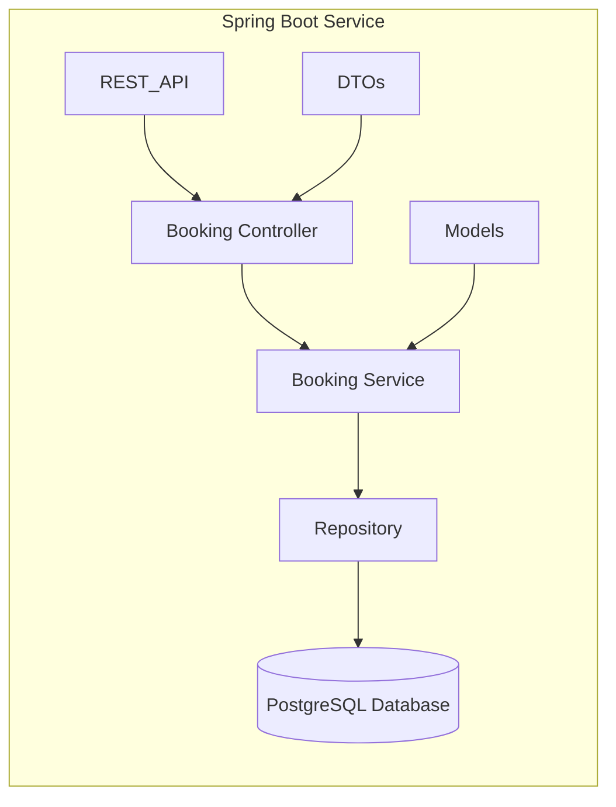

# README

## Informations

**System name** : Bike Reservation System

**Contributor** : [Romain](https://github.com/RomainChamb)

**Licence** : MIT Licence

**Context** : This project is a TDD Sandbox Project. I made it to gain experience with TDD. It is part of the "TDD in legacy code" series
from [Optivem Journal](https://journal.optivem.com/) and [Valentina Jemuović](https://www.linkedin.com/in/valentinajemuovic/)

## Use Cases

### Booking a bike
A rider can book a bike for a given date and duration. He can choose the type of bike during the booking process.

### Changing bike
A rider can change the type of bike he booked before the start of his rental period.

### Adding a bike
The admin can add a bike to the stock.

### Removing a bike
The admin can remove a bike from the stock.

## External systems
System clock

## Architecture Style
Monolith (no front as of now)

## Architecture diagram

## Tech stack
Java / Spring boot / Gradle / PostgreSQL

## Repository strategye
Mono-repo

## Branching strategy
Trunk Based Development

## Deployment Model
Local only (as of now)

## Project board
[Project's board](https://github.com/users/RomainChamb/projects/4/views/1)

## Start the application

Before starting the application, you have to run the runPostgresqlDockerForDev.sh script which will start the dockerize DB.

